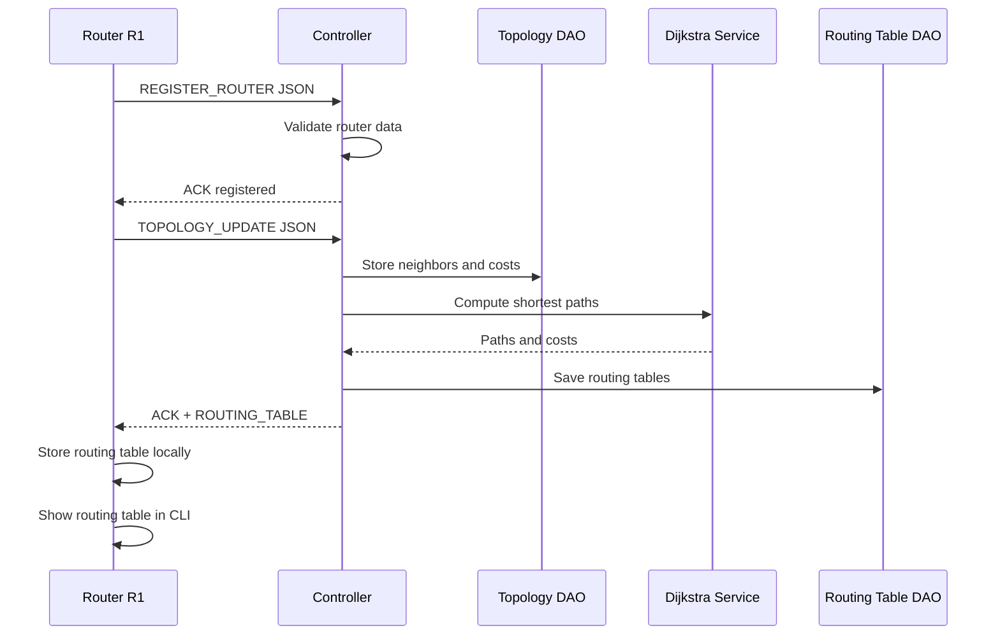
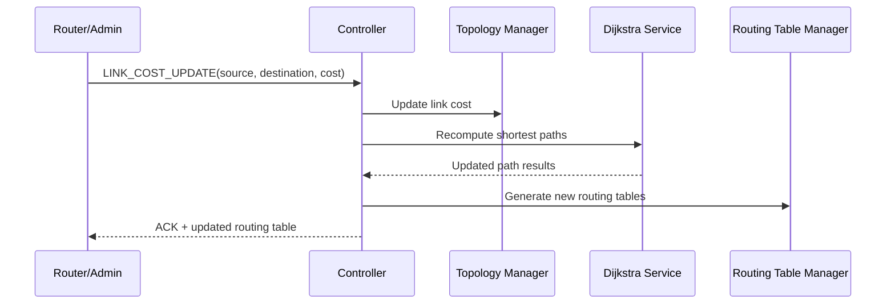

# Sequence Diagram

## Main Registration and Topology Flow

```mermaid
sequenceDiagram
    participant R1 as Router R1
    participant C as Controller
    participant TD as Topology DAO
    participant DS as Dijkstra Service
    participant RT as Routing Table DAO

    R1->>C: REGISTER_ROUTER JSON
    C->>C: Validate router data
    C-->>R1: ACK registered

    R1->>C: TOPOLOGY_UPDATE JSON
    C->>TD: Store neighbors and costs
    C->>DS: Compute shortest paths
    DS-->>C: Paths and costs
    C->>RT: Save routing tables
    C-->>R1: ACK + ROUTING_TABLE

    R1->>R1: Store routing table locally
    R1->>R1: Show routing table in CLI
```

## Link Cost Update Flow

```mermaid
sequenceDiagram
    participant R as Router/Admin
    participant C as Controller
    participant T as Topology Manager
    participant D as Dijkstra Service
    participant RT as Routing Table Manager

    R->>C: LINK_COST_UPDATE(source, destination, cost)
    C->>T: Update link cost
    C->>D: Recompute shortest paths
    D-->>C: Updated path results
    C->>RT: Generate new routing tables
    C-->>R: ACK + updated routing table
```
